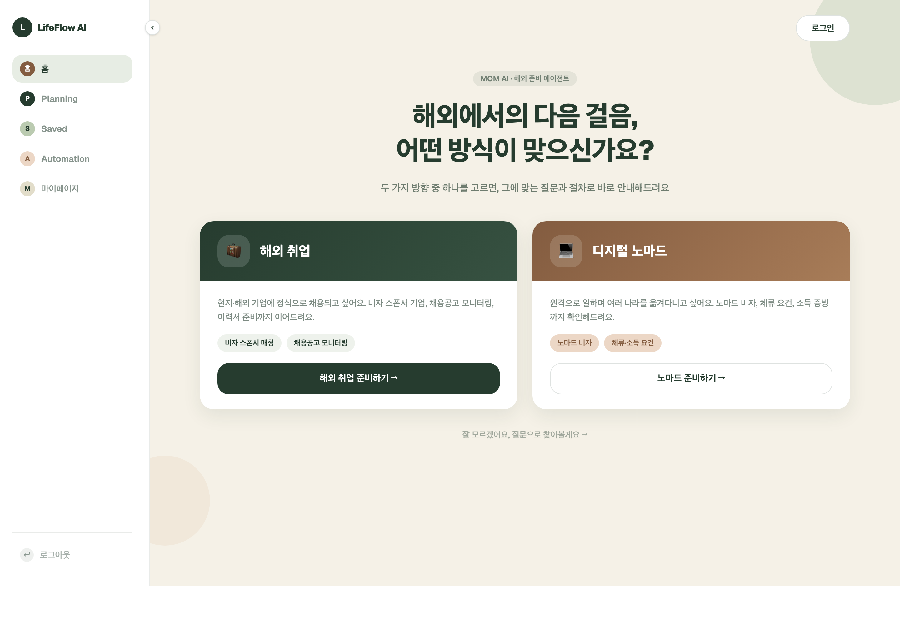
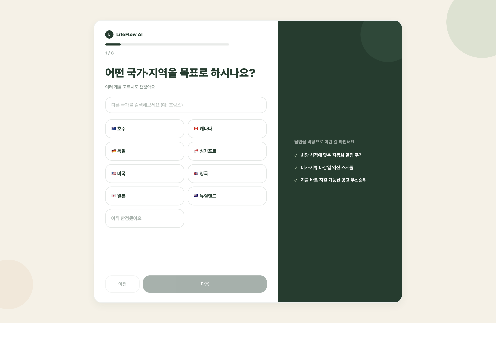
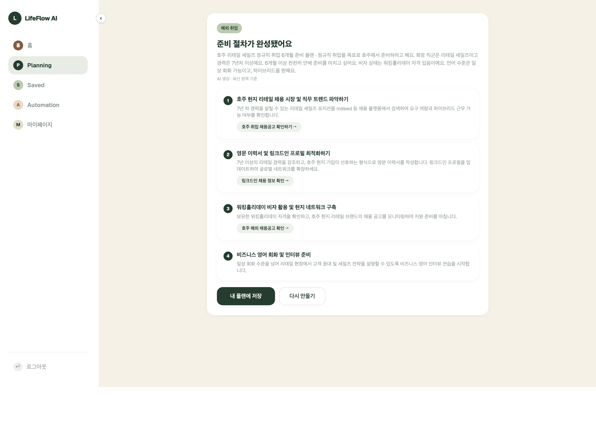
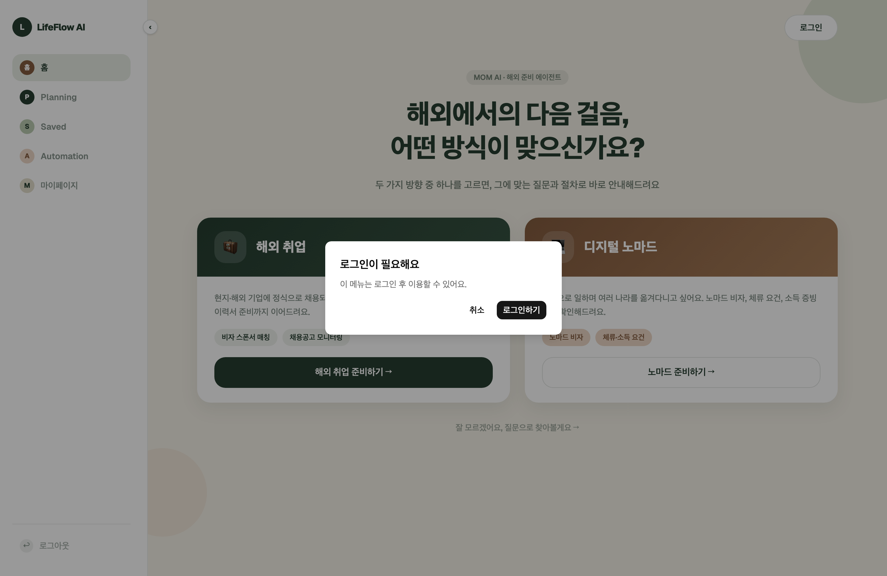

# LifeFlow AI (Mom AI)

> 해외취업 · 디지털노마드를 준비하는 사람에게, 매번 처음부터 찾아보지 않아도 되는 준비 파트너

포트폴리오 프로젝트입니다. React + NestJS 풀스택으로 직접 설계·구현했고, 아래는 "무엇을 만들었는가"보다
**"왜 이렇게 만들었는가"**에 초점을 맞춘 기록입니다.

---

## 0. 미리보기

| 홈 — 버티컬 선택 | Goal Input 마법사 |
|---|---|
|  |  |

| AI 플랜 결과 (실제 검색 그라운딩) | 비로그인 시 로그인 안내 모달 |
|---|---|
|  |  |

---

## 1. 문제 정의

사용자는 해외취업/디지털노마드를 준비할 때 이런 문제를 반복 경험합니다.

- **탐색 피로** — 비자 요건, 채용 플랫폼, 서류를 매번 다시 찾아봐야 함
- **행동 단절** — 정보를 찾아도 실제 행동(지원, 서류 준비)으로 이어지지 않음
- **저장 소실** — 한 번 찾은 정보를 저장하지 않아 다시 찾게 됨
- **자동화 공백** — 반복 확인이 필요한 일(새 채용공고, 마감일)을 자동화할 수단이 없음

이걸 **Planning → Save → Automation** 3단계 Loop로 쪼개고, 각 Loop의 전환율(사용자가 다음 단계로
넘어가는 비율)을 지표로 정의해 설계했습니다. 자세한 문제/지표 정의는 [`docs/problem-definition.md`](docs/problem-definition.md).

---

## 2. 중간에 있었던 피벗 — 그리고 그 이유

처음엔 청년지원금/해외준비/취업준비/디지털노마드 4개 목표 유형을 범용으로 다루는 서비스로 시작했습니다.
만들다 보니 문제가 보였습니다 — **4개 영역을 다 얕게 커버하려니, AI가 내놓는 답이 그냥 일반적인
챗봇 답변처럼 느껴졌습니다.** "이 서비스만의 답"이 아니라 "아무 LLM한테 물어봐도 나올 답"이었던 거죠.

그래서 **해외취업 + 디지털노마드** 2개 버티컬로 범위를 좁혔습니다. 이 둘을 고른 이유:
1. "많은 사람이 꿈꾸지만 어떻게 시작해야 할지 막막한 목표"라는 공통점이 있고
2. 비자 요건·채용 플랫폼·서류처럼 겹치는 실제 데이터 니즈가 있어서, 4개보다 훨씬 깊게 파고들 수 있음

의사결정 히스토리는 [`docs/decision-log-01-planning-loop.md`](docs/decision-log-01-planning-loop.md)의
"2026-07 개정" 섹션에 남겨뒀습니다 — 이전 결정을 지우지 않고 왜 바뀌었는지 그대로 추적할 수 있게요.

---

## 3. 아키텍처 결정 — 판단이 필요했던 지점들

### 3-1. Goal Input을 자유 대화형이 아니라 8단계 마법사로

처음엔 "AI가 하나씩 물어보는" 챗봇 형태를 생각했지만, 정해진 순서의 구조화된 질문 흐름(국가 → 직군 →
경력 → 목표 시점 → 비자 상태 → 언어 → 근무 형태)으로 결정했습니다.

**이유**: 자유 대화형은 "입력이 끝났다"는 시점이 모호해서, Planning Loop의 핵심 지표(GP1: 목표 입력
완료율)를 측정할 수 없습니다. 고정 순서 마법사는 마지막 스텝 제출 = 측정 가능한 완료 시점이 되고,
사용자 입장에서도 얼마나 남았는지 진행률로 보여줄 수 있습니다.

국가 선택지는 196개 넘는 국가를 손으로 입력하는 대신, **`Intl.DisplayNames` + ISO 3166-1 코드**로
브라우저가 직접 생성하도록 했습니다 — 국가명을 하드코딩하다 실수하는 것보다, 런타임이 가진 데이터를
쓰는 게 더 정확합니다. ([`frontend/src/constants/countries.ts`](frontend/src/constants/countries.ts))

### 3-2. "지어낸 숫자"를 보여주지 않기

AI 플래닝 결과 화면을 만들 때, 초기 목업엔 "128건 스캔 완료", "12건 매칭" 같은 신뢰감 있는 문구가
있었습니다. 그런데 지금 백엔드는 실제로 검색을 하지 않는 순수 LLM 텍스트 생성이라, 이 숫자들은
**전부 지어낸 값**이 됩니다.

그래서 로딩 화면과 결과 화면 모두, **실제로 존재하는 데이터만** 보여주도록 결정했습니다.
- AI가 실제로 준 링크(`actionUrl`)가 있을 때만 링크 버튼 표시
- 매칭 건수·스캔 진행률 같은 없는 데이터는 아예 안 보여주거나, 일반적인 문구로 대체
- Automation 페이지도 동일 — "지속 실행 중, 37건 매칭" 같은 라이브 모니터링 카드는 실제 n8n 연동
  전까지는 만들지 않고, 실제로 계산되는 D-day 리마인더만 구현

**이게 오히려 이 프로젝트의 핵심 판단 포인트라고 생각합니다.** "그럴듯하게 보이게" 만드는 것과
"정직하게 지금 할 수 있는 만큼만 보여주는 것" 사이에서 후자를 택했습니다. (이 원칙 때문에
"없는 데이터를 숨기는" 데서 멈추지 않고, 아래 3-3처럼 "진짜 데이터를 만드는" 방향까지 가게 됐습니다.)

### 3-3. 실제 검색 그라운딩 — 첫 시도는 실패, 다른 경로로 성공

Gemini API가 Google Search 그라운딩을 지원한다는 공식 문서를 보고 먼저 그 방식으로 시도했습니다.
- 이미 쓰고 있는 `gemini-3.1-flash-lite` 모델이 요구 조건(Gemini 3+)을 충족하는 것도 확인
- 문서에 나온 여러 페이로드 형태를 다 시도했지만, 전부 `400 Unknown field` 에러
- 네이티브 Gemini API로도 시도했지만 무료 티어 쿼터 초과(`429`)
- 이 API 키/모델 조합에서는 안 되는 걸 실측으로 확인하고, 원래 코드로 완전히 되돌림 (`git diff` 기준
  변경 사항 0으로 확인)

**Gemini 자체 그라운딩 대신, 검색과 생성을 분리하는 RAG 구조로 다시 접근**했습니다.
- [Tavily](https://tavily.com)(LLM 에이전트용으로 만들어진 검색 API, 무료 1,000크레딧/월)로
  실제 웹 검색을 수행
- 검색 결과(제목/URL/본문 스니펫)를 Gemini 프롬프트에 "실제 검색 결과"로 넣어주고,
  **"actionUrl은 이 목록에 있는 URL 중에서만 골라라"**고 명시적으로 강제 — 지어낸 링크를
  다시 원천 차단
- 처음엔 검색 범위를 제한 없이 열어뒀더니 블로그·유튜브 후기가 주로 나와서, 검색어에
  "채용공고 채용정보"를 명시하고 `include_domains`로 실제 채용 플랫폼(Seek/Indeed/LinkedIn/
  WeWorkRemotely 등, 버티컬별로 다르게)으로 좁힘 → 실제 채용 공고/검색 페이지 링크로 개선

**결과**: "호주 원격 백엔드 개발자, 1~3년차" 요청 시 실제 LinkedIn/RemoteRocketship/Crossover의
해당 조건에 맞는 채용 검색 페이지 링크가 돌아옵니다 — 모델이 학습 데이터로 추측한 게 아니라
그 순간 실제로 검색해서 찾은 결과입니다. ([`backend/src/planning/tavily-search.service.ts`](backend/src/planning/tavily-search.service.ts))

**후속 버그 — 도메인 필터가 새고 있었다**: 실제 사용해보니 "호주 리테일 세일즈, 7년차 이상"
같은 특정 프로필로도 결과가 전부 한국어로 된 "호주 취업" 소개 페이지였습니다. 실제 Tavily
호출을 직접 재현해서 원인 두 가지를 확인했습니다.
1. `include_domains`에 `"indeed.com"`을 통으로 넣어서 `kr.indeed.com`(한국어 SEO 페이지)까지
   같이 허용되고 있었음 → `exclude_domains`로 한국어 리전 서브도메인을 명시적으로 차단
2. 검색어를 한국어(직군/경력/근무형태 라벨)로 만들다 보니 영어권 채용 사이트 본문과 매칭이
   안 됨 → 위저드가 이미 갖고 있던 영문 kebab-slug 값(`retail-sales`, `senior`, `hybrid` 등)과
   ISO 국가 코드를 이용해 영어 쿼리를 만들도록 변경 ([`search-query.util.ts`](backend/src/planning/search-query.util.ts))

수정 전/후 같은 프로필로 라이브 재검증: 15/15 결과가 `kr.indeed.com`/`kr.linkedin.com`의
일반 소개 페이지 → 수정 후 15/15 결과가 `au.indeed.com`/`seek.com.au`/`au.linkedin.com`의
실제 채용공고로 바뀜.

### 3-4. Automation — n8n은 스케줄러, 로직은 백엔드에

채용/원격구인 모니터링 자동화는 연결 시점에 1회 검색으로 끝나지 않고 계속 재검색되어야
합니다. 처음엔 결정로그 03에 적은 대로 "n8n이 폴링·검색을 담당하고 웹훅으로 결과를 콜백"하는
구조를 계획했지만, 막상 n8n의 노드 기반 워크플로우 안에 검색/중복 제거/매칭 계산 로직을 넣어
보니 버전 관리도 안 되고 단위 테스트도 못 하는 게 문제였습니다.

**그래서 역할을 다시 나눴습니다**: n8n은 정해진 주기로 백엔드 내부 엔드포인트
(`POST /internal/automation-checks/run`, `X-Internal-Secret` 헤더로 보호)를 호출하는
스케줄러 역할만 하고, 실제 검색·중복 제거(`seenResultUrls` 기반)·매칭 건수 계산은 전부
NestJS(`AutomationsService.recheckMonitoringAutomations`) 안에서 일반 TypeScript 코드로
처리합니다. 결과는 실제 `matchCount`/`newMatchCount`/`lastCheckedAt`으로 저장되고,
`AutomationLiveMonitorCard`가 이 데이터를 그대로 보여줍니다. 자세한 배경은
[`docs/decision-log-03-automation-loop.md`](docs/decision-log-03-automation-loop.md)의
2026-07-22 개정 참고.

---

## 4. 지금 뭐가 진짜로 동작하고, 뭐가 아직 시뮬레이션인가

| 기능 | 상태 | 비고 |
|---|---|---|
| Google/카카오 OAuth 로그인 | ✅ 실제 동작 | |
| AI 플랜 생성 (Gemini) | ✅ 실제 동작 | 실패 시 정적 템플릿으로 폴백 |
| 8단계 목표 입력 마법사 | ✅ 실제 동작 | localStorage 이어하기 지원 |
| 플랜 저장 / 진행률 | ✅ 실제 동작 | 진행률은 단계별 완료 수 카운터 기반(개별 단계 플래그 아님) |
| 자동화 연결 (문서 정리) | ✅ 실제 동작 | 정규식으로 단계 텍스트에서 서류명 추출 |
| 자동화 연결 (마감일 리마인더) | ✅ 실제 동작 | 날짜 계산은 진짜, 알림 발송(이메일/푸시)은 아직 없음 |
| Saved 페이지 "자동화 연결됨" 표시 | ✅ 실제 동작 | Automations 테이블 실제 조회 |
| AI 검색 그라운딩 (Tavily + Gemini) | ✅ 실제 동작 | 실제 채용 플랫폼 검색 결과로 actionUrl 생성, 위 3-3 참고 |
| 채용/원격구인 지속 모니터링 | ✅ 실제 동작 | n8n 스케줄 트리거 → 백엔드가 재검색·매칭 계산, 위 3-4 참고 |

---

## 5. 기술 스택

| 분류 | 기술 |
|---|---|
| Frontend | React 19, TypeScript, Tailwind CSS v4, shadcn/ui, React Router v7 |
| 서버 상태 | TanStack Query v5 |
| 클라이언트 상태 | Zustand v5 |
| 폼 | React Hook Form |
| Backend | NestJS, TypeORM |
| 인증 | Passport (Google/Kakao OAuth), JWT |
| AI | Google Gemini (OpenAI 호환 엔드포인트) + Tavily Search API (RAG 그라운딩) |

---

## 6. 로컬 실행

```bash
npm install          # 루트, frontend, backend 각각 필요 시 설치
npm run dev          # frontend + backend 동시 실행 (concurrently)
```

- Frontend: http://localhost:5173
- Backend: http://localhost:3000
- 백엔드 `.env`에 `GEMINI_API_KEY`, `TAVILY_API_KEY`, `GOOGLE_CLIENT_ID/SECRET`, `KAKAO_CLIENT_ID/SECRET` 등 필요
  (`TAVILY_API_KEY`가 없으면 검색 그라운딩 없이 기존처럼 동작 — 서비스가 죽지 않음)

---

## 7. 폴더 구조

```
docs/               문제정의·해결방안탐색·결정로그·OKR (기능 구현 전 항상 먼저 확인하는 문서)
frontend/            React 앱 (Loop 단위 features/ 구조)
backend/             NestJS API 서버
```

Loop 구조와 프론트엔드 코딩 규칙(map 렌더링, 컴포넌트 분리 기준 등)은 [`CLAUDE.md`](CLAUDE.md)에
정리돼 있습니다.

---

## 8. 다음 계획

1. 저장 플랜의 단계별 완료 상태를 카운터가 아닌 개별 플래그로 전환
2. 검색 도메인 필터를 두 버티컬 통합 목록이 아니라 국가별로 더 세분화, 비자 요건 등 채용 외
   정보도 그라운딩 확장
3. 비자·체류 마감일 리마인더 — 날짜 계산 이후 실제 발송(이메일/푸시)까지 연결
4. 백엔드 핵심 로직(검색 쿼리 빌더, 위저드 스텝 스킵 로직) 테스트 코드 추가
